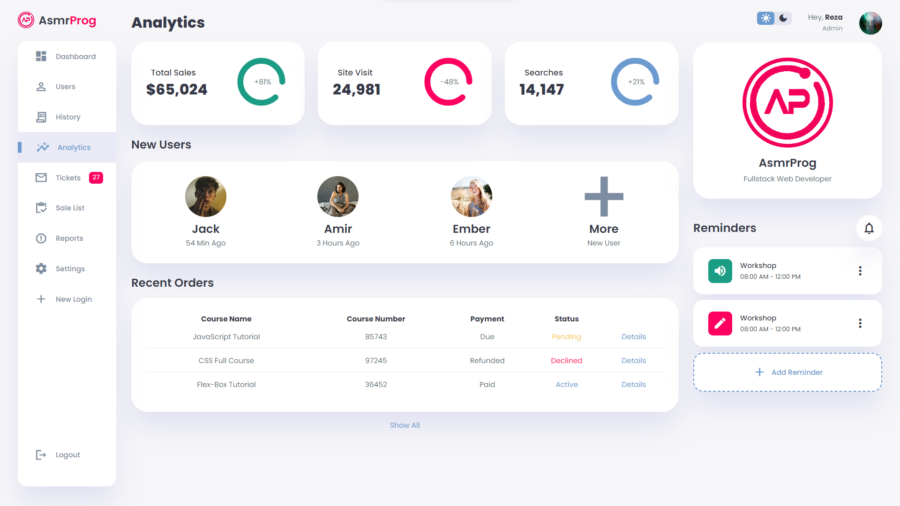

# Responsive Dashboard Design #1
Te voy a mostrar cómo utilizar HTML, CSS y JavaScript modernos para crear un panel de administración completamente respocivo con funcionalidad de tema claro y oscuro. Utilizaremos Variables CSS, CSS Grid, CSS Flexbox, consultas de medios para nuestro diseño respocivo y transiciones y animaciones CSS para algunos efectos de animación interesantes.

# Screenshot
Here we have project screenshot :

