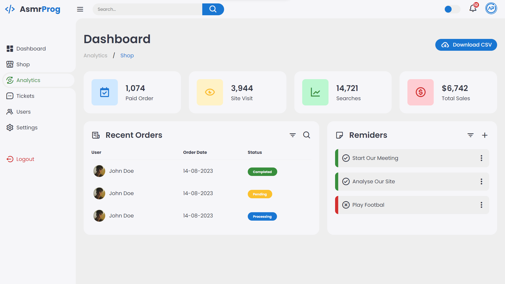
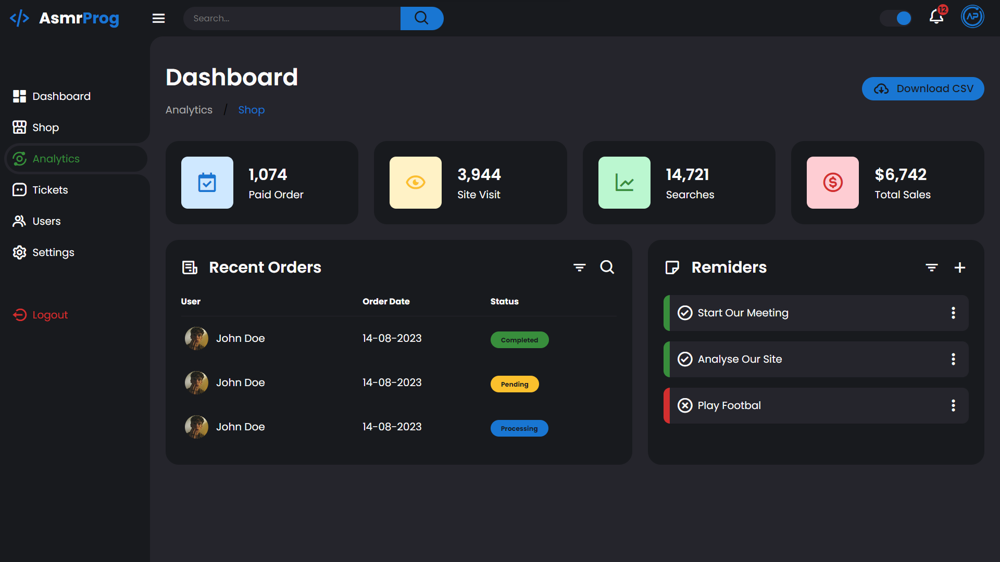

# Responsive Dashboard Design #2
Te mostraré cómo usar HTML, CSS y JavaScript modernos para crear un panel de administración completamente receptivo con funcionalidad de tema claro y oscuro. Utilizaremos Variables CSS, CSS Grid, CSS Flexbox, consultas de medios para nuestro diseño receptivo y transiciones y animaciones CSS para algunos efectos de animación geniales.

# Screenshot
Here we have project screenshot :

